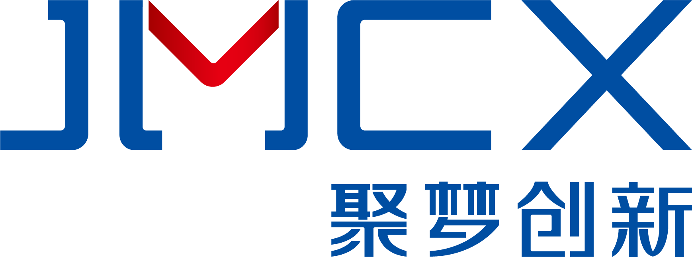
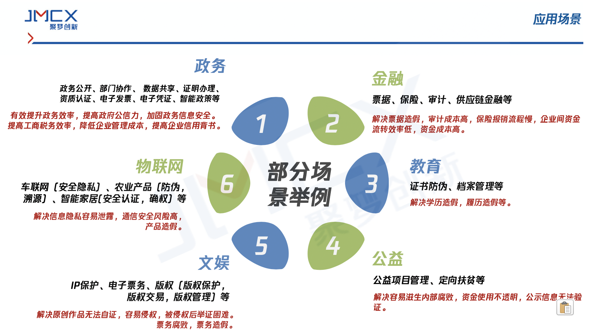
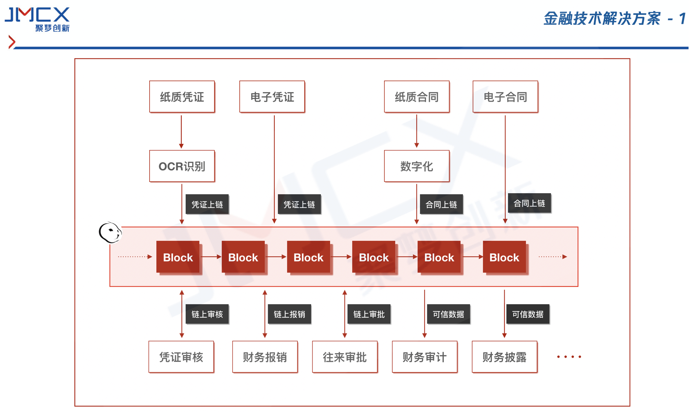
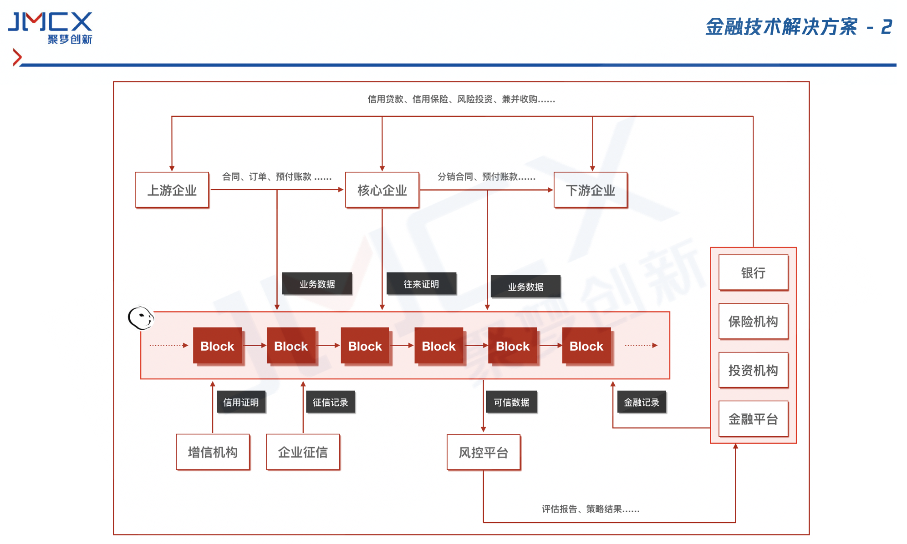
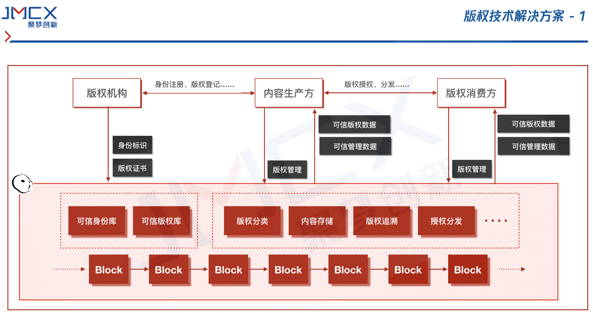

# blockchain-solutions
聚梦创新区块链技术服务解决方案

## 应用场景

## 解决方案
#### 金融技术解决方案
> 通过区块链实现数据的可信存储，结合基于数据多级加密和多维权限控制技术，解决电子数据易伪造、易篡改、难溯源、难校验的问题，联合共建区块链可信生态联盟。

###### 提高数据公信力
基于区块链不可篡改的技术特征，多家权威机构参与共识，解决存证数据可信度问题。

###### 灵活适应各应用场景
方案提供基础区块链可信存储能力，可构建各类存证场景应用，拓展性极强。

###### 可信联盟
建立信用体系联盟，实现“数字存证+”的存证、合作、共赢新生态。

**您的机构也需要区块链解决方案？请联系我们： [聚梦创新官网](https://jmcx.io)**

#### 版权技术解决方案
> 支持一站式API接入，并提供可视化界面，提供原创登记、版权监测、电子证据采集与公证、司法诉讼全流程服务等。

**您的机构也需要区块链解决方案？请联系我们： [聚梦创新官网](https://jmcx.io)**

